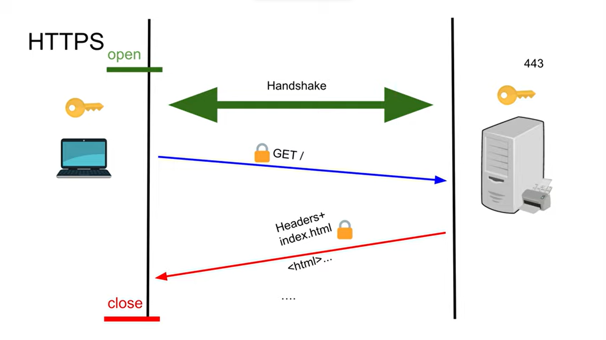

Here's a detailed overview of **Transport Layer Security (TLS)**, focusing on **TLS 1.2** and **TLS 1.3**, highlighting their differences, features, and improvements.

### What is Transport Layer Security (TLS)?

**Transport Layer Security (TLS)** is a cryptographic protocol designed to provide secure communication over a computer network. It ensures privacy, integrity, and authenticity of data exchanged between clients and servers. TLS is widely used for securing communications on the Internet, particularly for web traffic, email, and instant messaging.

### TLS 1.2

**TLS 1.2**, released in 2008, introduced several enhancements over its predecessor, TLS 1.1. It remains widely used and offers robust security features.

#### Key Features of TLS 1.2:

1. **Improved Security Algorithms**:
   - Supports newer cryptographic algorithms such as SHA-256 for hashing and AES for encryption.
   - Allows the use of authenticated encryption with associated data (AEAD) modes like Galois/Counter Mode (GCM).

2. **Extended Server Name Indication (SNI)**:
   - Allows multiple domains to be hosted on a single IP address, helping to secure virtual hosting environments.

3. **Support for Secure Hash Algorithm 2 (SHA-2)**:
   - Provides better resistance against hash collisions compared to older algorithms like SHA-1.

4. **Client and Server Authentication**:
   - Supports both client and server authentication via digital certificates, enhancing security.

5. **Backwards Compatibility**:
   - Designed to be compatible with earlier versions of TLS and SSL, allowing gradual upgrades without disrupting existing systems.

### TLS 1.3

**TLS 1.3**, finalized in 2018, represents a significant overhaul of the TLS protocol, aimed at improving both security and performance.

#### Key Features of TLS 1.3:

1. **Simplified Handshake**:
   - Reduces the number of round trips required to establish a secure connection, improving performance. The handshake can be completed in just one round trip (1-RTT) compared to TLS 1.2, which often required two (2-RTT).

2. **Enhanced Security**:
   - Removes outdated and vulnerable cryptographic algorithms, such as RC4 and SHA-1, ensuring that only secure algorithms are supported.
   - Implements forward secrecy by default, meaning that even if a server's private key is compromised, past sessions cannot be decrypted.

3. **0-RTT Resumption**:
   - Allows clients to send data immediately after the handshake for previously connected servers, further reducing latency.

4. **Fewer Cipher Suites**:
   - Simplifies the cipher suite negotiation process by limiting the number of supported cipher suites to those that provide better security and performance.

5. **Improved Privacy**:
   - Encrypts more of the handshake process, making it harder for third parties to observe connection metadata, such as the server being accessed.

### Comparison of TLS 1.2 and TLS 1.3

| Feature                        | TLS 1.2                           | TLS 1.3                           |
|--------------------------------|-----------------------------------|-----------------------------------|
| **Handshake Process**          | Requires multiple round trips (2-RTT) | Single round trip (1-RTT)         |
| **Cipher Suites**              | Supports a wide range of cipher suites, including some outdated ones | Limited to modern, secure cipher suites |
| **Forward Secrecy**            | Optional                          | Mandatory                          |
| **0-RTT Resumption**           | Not supported                     | Supported                          |
| **Encryption of Handshake**    | Minimal encryption                | Most of the handshake is encrypted |
| **Deprecated Algorithms**      | Supports older algorithms          | Removes outdated algorithms        |
| **Performance**                | Slower connection establishment    | Faster connection establishment    |

### Conclusion

The evolution from TLS 1.2 to TLS 1.3 marks a significant advancement in secure communications. TLS 1.3 enhances security by eliminating outdated cryptographic methods, simplifying the handshake process, and improving performance. Organizations and developers should aim to adopt TLS 1.3 wherever possible to benefit from these improvements and ensure secure, efficient communications over the Internet. 

Feel free to adjust any part of this text or request additional details as needed!