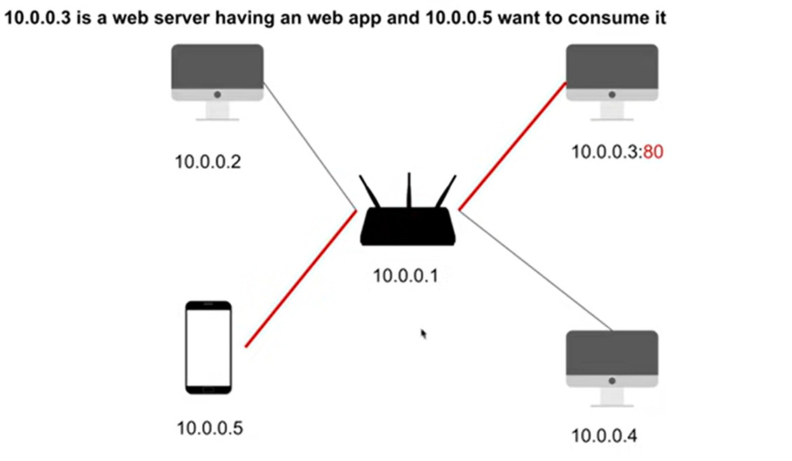
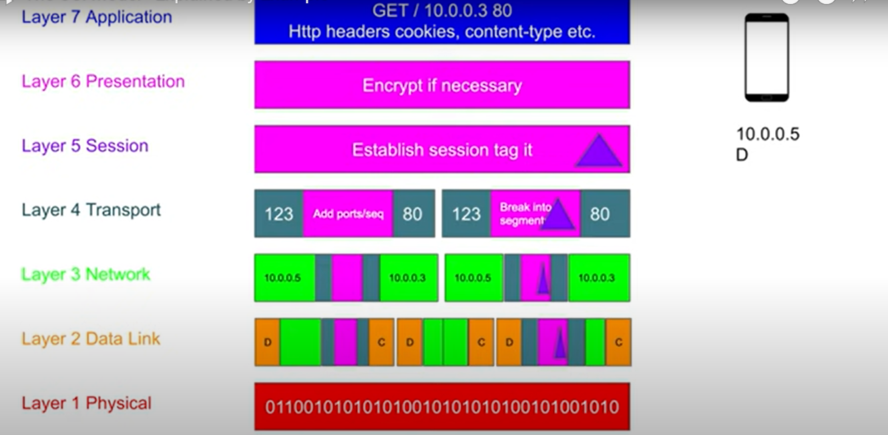
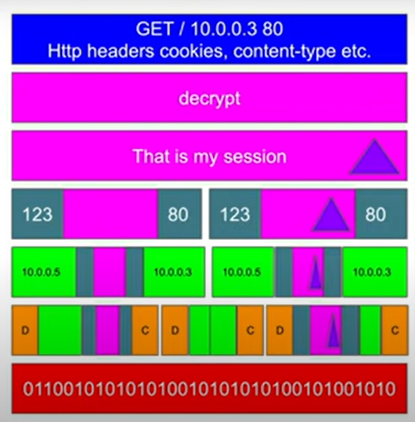

# Summary of the OSI Model from a Software Engineer's Perspective (with Corrections):
You've got the general idea down, but let's clarify some points:

* Layer 1 (Physical): You're spot on! This layer deals with the physical transmission medium and how bits are represented as signals.

* Layer 2 (Data Link):

Correct about frames and MAC addresses.
Frames don't necessarily reach all devices in a modern switched network. Switches learn MAC addresses and direct frames more intelligently.
Unsecured networks or misconfigured switches can lead to data leakage, as you mentioned.
* Layer 3 (Network):

This layer handles IP addressing and routing, enabling communication between different networks.
* Layer 4 (Transport):

This layer manages communication between processes on different devices using ports. TCP and UDP operate at this layer.
* Layer 5 (Session):

You're right, this layer manages sessions between applications. It's responsible for establishing, coordinating, and terminating connections.
* Layer 6 (Presentation):

HTTPS encrypts data! It uses TLS/SSL to encrypt communication, ensuring confidentiality and integrity. HTTPS is not just for website identity (that's handled by certificates).
VPNs also encrypt data, but they operate at Layer 3 (tunneling network traffic).
Encryption at this layer is crucial for protecting data, especially on public Wi-Fi.
* Layer 7 (Application):

This layer is where applications interact with the network. HTTP requests, including headers, cookies, etc., are handled here.
Key Corrections:

HTTPS encrypts data. It's a fundamental security aspect of the web.
VPNs operate at Layer 3, not Layer 6.
Data frames might not reach all devices in a switched network.
Remember: The OSI model is a conceptual framework. Real-world implementations might not strictly adhere to all layers.

